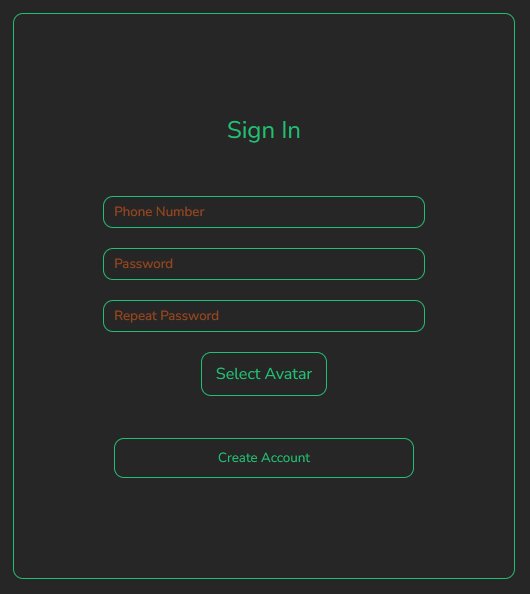
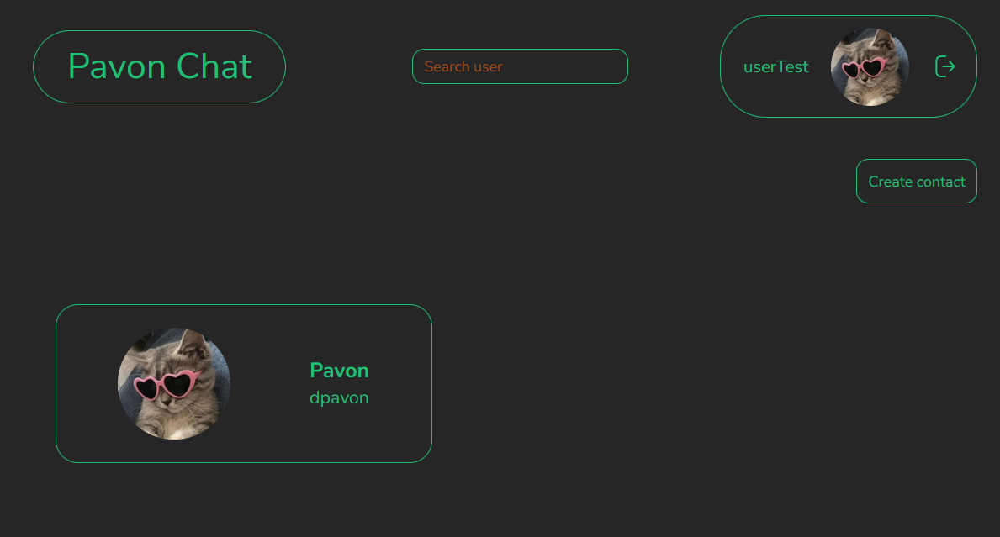
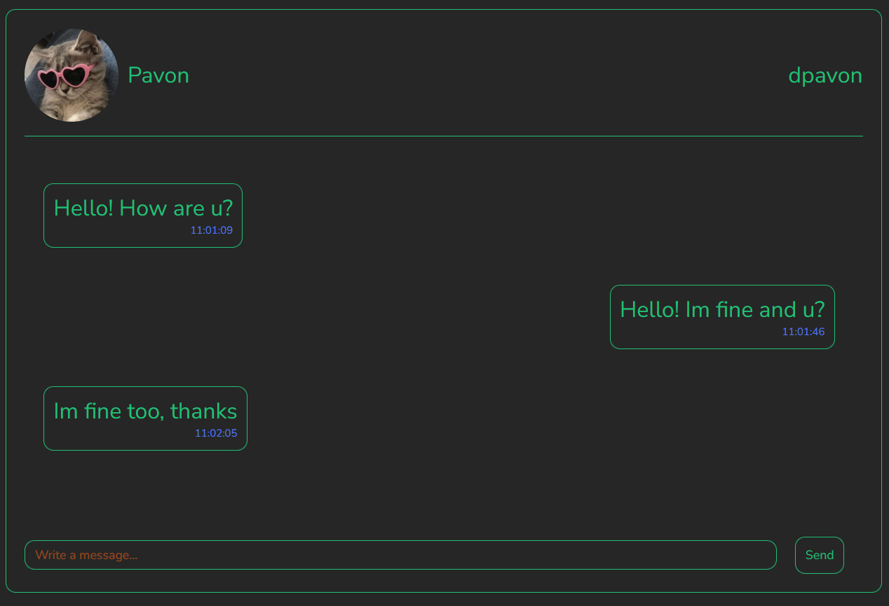

# pavonChat

### A messaging application that enables real-time communication between users. It offers a user-friendly and secure interface where users can sign up, log in, and connect with others to exchange messages seamlessly.

<div align="center" style="margin: 30px;">
  
</div>

#### The goal of this project is to build a complete messaging application using only MySQL and vanilla PHP, without relying on any frameworks. The application will enable users to send messages to other people efficiently.

## How to develop

This development is ready to deploy, meaning that if you want to run it on a server, it's as simple as cloning the repository on a Linux server or machine with Docker installed.

To deploy the application, you only need to clone the repository and run the following command:

```
$ sudo bash deployChat.sh
```

Once it is deployed, you can connect to the web aplication from [localhost:8090](http://localhost:8090) and to PhpMyAdmin from [localhost:8091](http://localhost:8091)

<div align="center" style="margin: 30px;">
  
</div>

## Documentation

### Classes

This application has three core classes: one for users, another for contacts, and another for messages. Each class manages its own database connections. This way, if we ever change the database system, the code remains unaffected.

There is a generic class called DB, which is a dependency for each core class. The DB class handles the connection to any of the tables. This approach makes everything much more modular and independent.

### Users

In the users table, we store several pieces of information: the user ID, the username or phone number, their password, and their avatar.

One of the additional features I wanted to add is that passwords are stored fully encrypted. This way, we ensure that the connection is always secure and that no sensitive data is stored.

<div align="center" style="margin: 30px;">
  
</div>

### Contacts

When a user wants to send messages to another, they first need to add them to the contacts table. The contacts table will store the contact's first name, last name, username or phone number, the avatar assigned to the user, and the ID of the user who adds the new contact.

Both the ID of the user who adds and the phone number are foreign keys. This ensures that the user being added exists in the users database. This way, we can manage the messaging section between users more easily.

<div align="center" style="margin: 30px;">
  
</div>

### Messages

When a user has a contact added, they can send them messages. In the message class, we store the message ID, the sender's ID, the receiver's ID, the date the message is sent (which is automatically set), and the message content.

<div align="center" style="margin: 30px;">
  
</div>

### Search contacts

Once you've logged in to the page, you'll be able to see all your contacts. Above them, there's a search bar where you can filter by your contact's phone number, in case you're unable to find a friend's contact because you have many! :D

This functionality filters the contacts displayed in the user list using a GET request. I know there are more elegant and efficient ways to do it, but this one seemed like the fastest and easiest at the time of implementing it.

### Database structure

If you want to see the database structure, here's a small example.

<div align="center" style="margin: 30px;">
  
</div>

## Disclaimer

I am aware that this project has many areas for improvement, such as changing the Spanglish, improving some database queries, optimizing the chat connection, fixing the bug with image registration that allows overwriting avatar images, etc. However, since the main goal of this project was to allow the creation of user accounts that could send and receive messages, I consider the project finished.

## Contact me

If you want to get in touch with me or discuss anything, feel free to contact me via [my LinkedIn](www.linkedin.com/in/pavondaniel)
